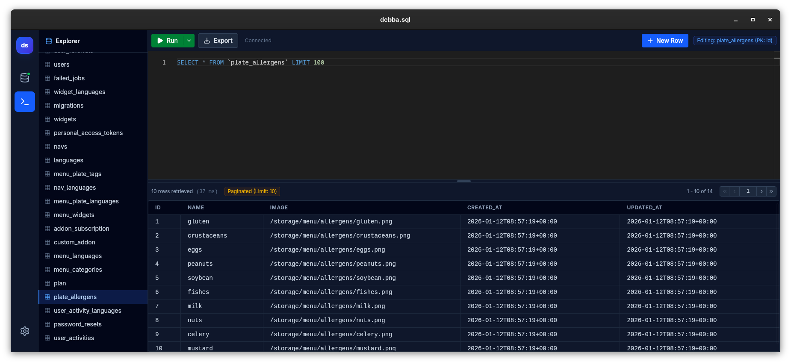

# tabularis


[](https://snyk.io//test/github/debba/tabularis?targetFile=package.json)

A lightweight, developer-focused database management tool, built with Tauri and React.

> 💡 **Origin Story:** This project was born from a **vibe coding** session — an experiment in fluid, agent-assisted development to build a functional tool from scratch in record time.

## Release Download:

<!-- DOWNLOAD_SECTION_START -->
[](https://github.com/debba/tabularis/releases/download/v0.5.0/tabularis_0.5.0_x64-setup.exe) [](https://github.com/debba/tabularis/releases/download/v0.5.0/tabularis_0.5.0_x64.dmg) [](https://github.com/debba/tabularis/releases/download/v0.5.0/tabularis_0.5.0_amd64.AppImage)
<!-- DOWNLOAD_SECTION_END -->

<div align="center">
  
</div>

## Gallery

<div align="center">
  
  
</div>
<div align="center">
  
  
</div>

## Features

### 🚀 New in v0.5.0

- **Advanced Schema Management:**
  - **DataGrip-style Explorer:** Sidebar tables now expand to show columns, keys, foreign keys, and indexes.
  - **Table Structure Modification:**
    - **Manage Columns:** Add, modify, and delete columns with type, length, nullability, and default value support.
    - **Manage Indexes:** Create and delete indexes (including Unique).
    - **Manage Foreign Keys:** Create and delete foreign keys with support for ON DELETE/UPDATE actions.
    - **Delete Table:** Context menu option to drop tables safely.
- **Enhanced Data Editing:**
  - **Smart Foreign Key Selection:** New/Edit Row modals now provide a rich dropdown for Foreign Keys, showing context from referenced tables (e.g. "ID - Name | Email") instead of just IDs.
  - **Improved Inputs:** Auto-clearing of length for non-sized types (INT, BOOL) and better type handling.
- **DataGrid Improvements:**
  - **Row Selection:** Click row number to select, Shift+Click for range, Ctrl+Click for multiple.
  - **Row Numbering:** Fixed column for row numbers similar to IDEs.
- **Auto-Refresh:** Sidebar automatically refreshes structure after schema changes.

### 🔌 Connection Management

- Support for **PostgreSQL**, **MySQL/MariaDB**, and **SQLite**.
- Save and manage multiple connection profiles.
- Secure local persistence of connection settings.
- **SSH Tunneling:** Connect to remote databases securely via SSH tunnels.

### 🗄️ Database Explorer

- **Sidebar Navigation:** Quickly browse tables and saved queries.
- **Context Actions:**
  - Right-click tables to: `Select Top 100`, `Count Rows`, `View Schema`, `Copy Name`.

### 📝 SQL Editor

- **Monaco Editor:** Industry-standard editor with syntax highlighting.
- **Multiple Tabs:** DataGrip-style tab management with connection isolation.
- **Execution:** Run queries with `Ctrl+Enter` or Run button.
- **Partial Execution:** Select specific text to run only that portion.
- **Query History:** (Saved Queries feature covers this usage).

### 🎨 Visual Query Builder (Experimental)

- **Drag-and-Drop Interface:** Build queries visually using ReactFlow canvas.
- **Table Nodes:** Drag tables from the sidebar to the canvas.
- **Visual JOINs:** Connect columns between tables to create JOIN relationships.
- **JOIN Types:** Click edge labels to cycle through INNER, LEFT, RIGHT, FULL OUTER, and CROSS joins.
- **Column Selection:** Check columns to include in SELECT, click to configure aggregations and aliases.
- **Aggregate Functions:** Support for COUNT, SUM, AVG, MIN, MAX, COUNT DISTINCT with auto-generated GROUP BY.
- **Advanced Filters:** Build WHERE/HAVING conditions with AND/OR logic.
- **Sorting & Limits:** Configure ORDER BY and LIMIT clauses.
- **Real-time SQL Generation:** See the generated query update as you build.

<div align="center">
  
</div>

### 📊 Data Grid

- **Interactive Results:** Fast rendering of large result sets.
- **Inline Editing:** Double-click any cell to edit data (requires Primary Key).
- **Row Management:** Right-click to delete rows.
- **Create New Row:** Use "New Row" button to insert data into tables.
- **Export Data:** Export query results to CSV or JSON formats.

### 💾 Configuration Storage

Connection profiles are saved locally in `connections.json` at:

- **Linux:** `~/.config/tabularis/`
- **macOS:** `~/Library/Application Support/tabularis/`
- **Windows:** `%APPDATA%\tabularis\`

## Tech Stack

- **Frontend:** React 19, TypeScript, Tailwind CSS v4, Lucide Icons.
- **Backend:** Rust, Tauri v2, SQLx (Async, Type-safe).
- **Build Tool:** Vite.

## Development

### Prerequisites

- Node.js (v18+)
- Rust (Stable) & Cargo
- Linux dependencies (if on Linux): `libwebkit2gtk-4.1-dev`, `build-essential`, `libssl-dev`.

### Setup

1. Install dependencies:
   ```bash
   npm install
   ```
2. Run in development mode:
   ```bash
   npm run tauri dev
   ```

### Building for Production

To build a standalone executable/installer:

```bash
npm run tauri build
```

## Roadmap

- [x] Multi-database support
- [x] Schema introspection
- [x] SQL Execution & Results
- [x] Inline Editing & Deletion
- [x] Create New Row
- [x] Data Export (CSV/JSON)
- [x] Saved Queries & Persistence
- [x] Pagination & Result Limiting
- [x] Multiple Tabs support
- [x] Visual Query Builder (Experimental)
- [ ] Database Export/Dump
- [ ] Multi-statement execution

## License

Apache License 2.0
